# Frontend da API food explorer
## Visão Geral

Bem-vindo ao Food Explorer, esse repositório se trata do desenvolvimento do front-end para uma aplicação em Node.js que permite gerenciar pratos, ingredientes, categorias e favoritos de usuários. Esta documentação fornecerá uma visão geral da aplicação, instruções de configuração e como utilizar suas funcionalidades.

você pode testar a aplicação neste [link](https://main--foodexplorer-maxtr.netlify.app/).

>Login admin: max@email.com

>Senha admin: 123

[Backend da aplicação](https://github.com/Maxtherox/foodexplorer-nodejs-backend)
## Telas da aplicação

### Login desktop
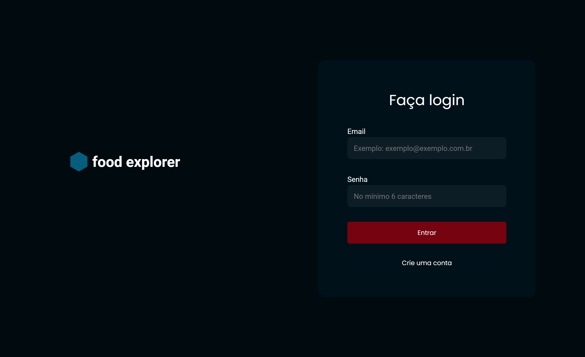
### Cadastro desktop
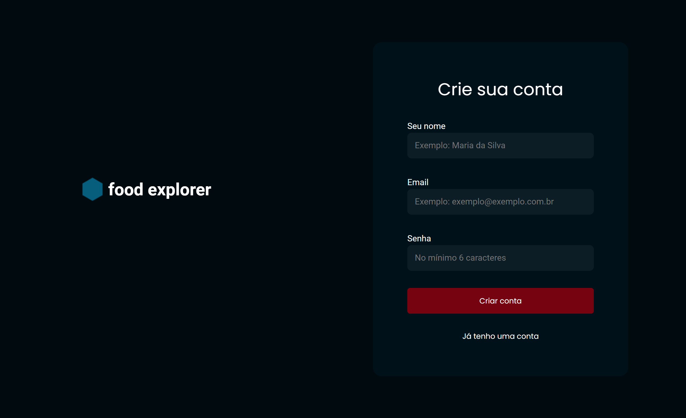

### Home desktop

### Details food desktop

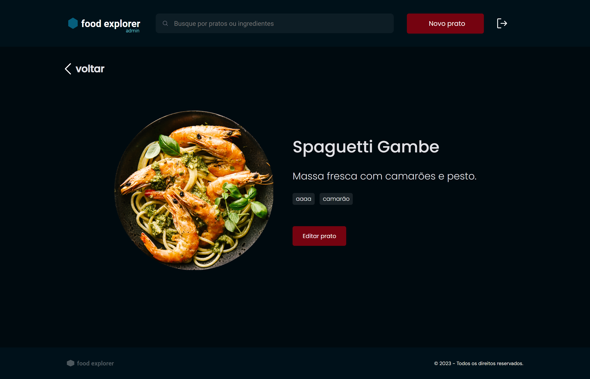

### Edit food desktop

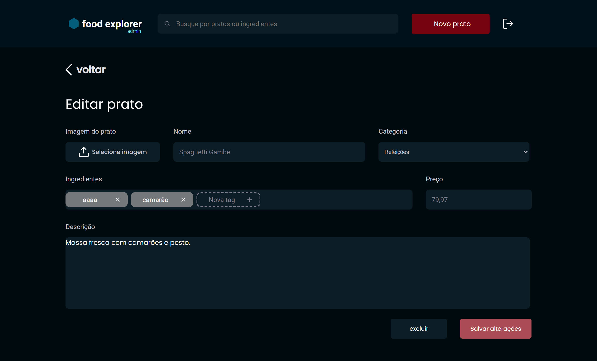

### New food desktop

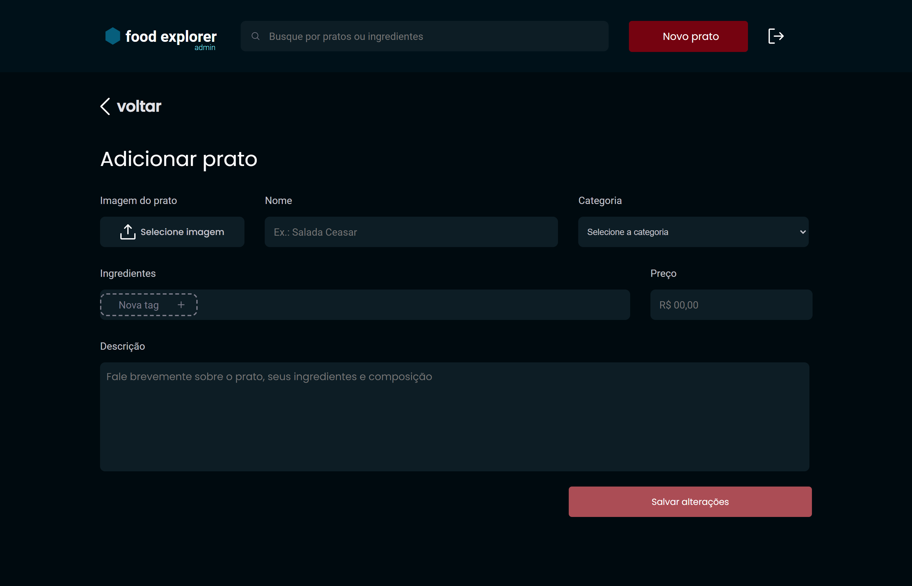

### 404 error desktop

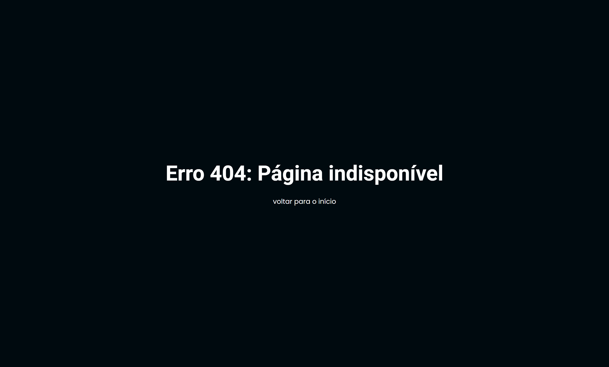

### 
Login & Cadastro mobile

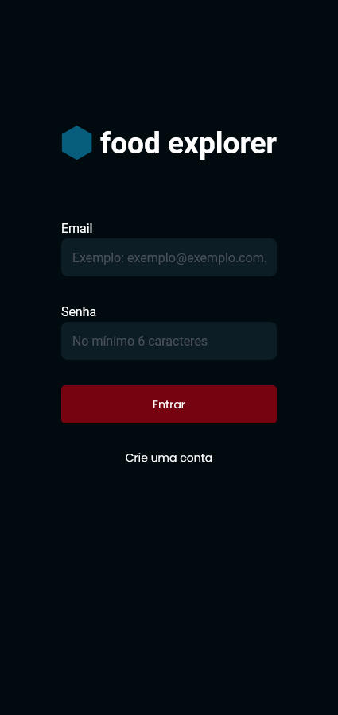
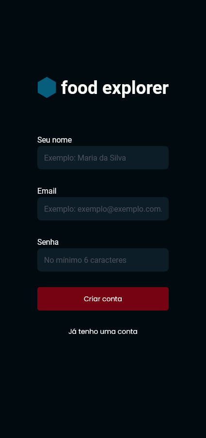

### 
New food & Edit food mobile

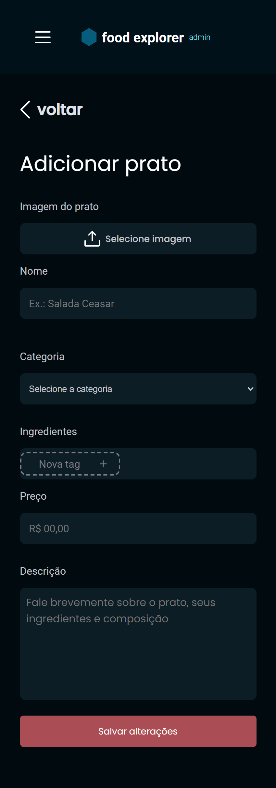
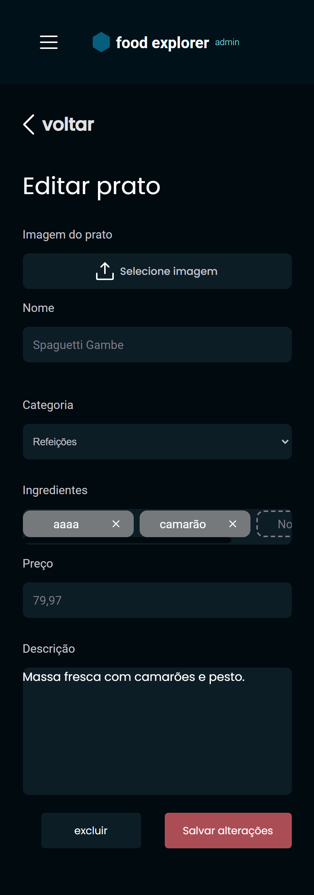

### 
Details food mobile

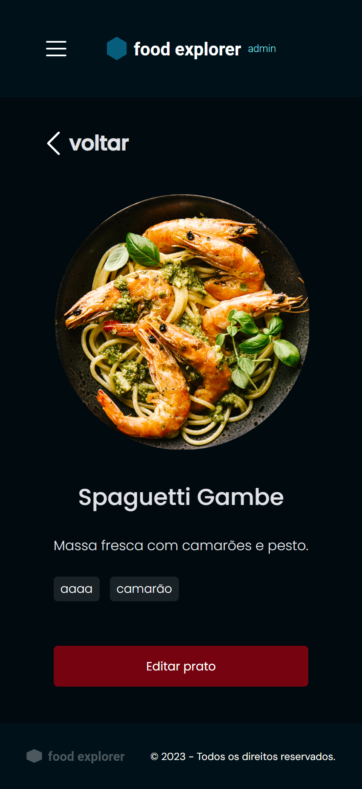

### 
menu mobile

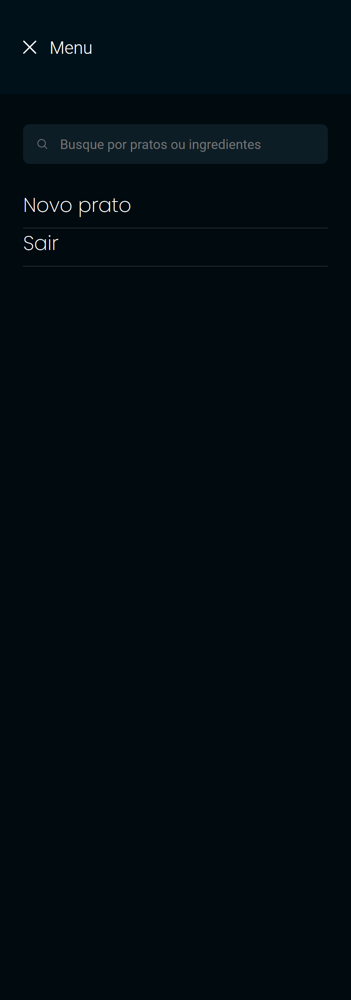

### 
404 error mobile

